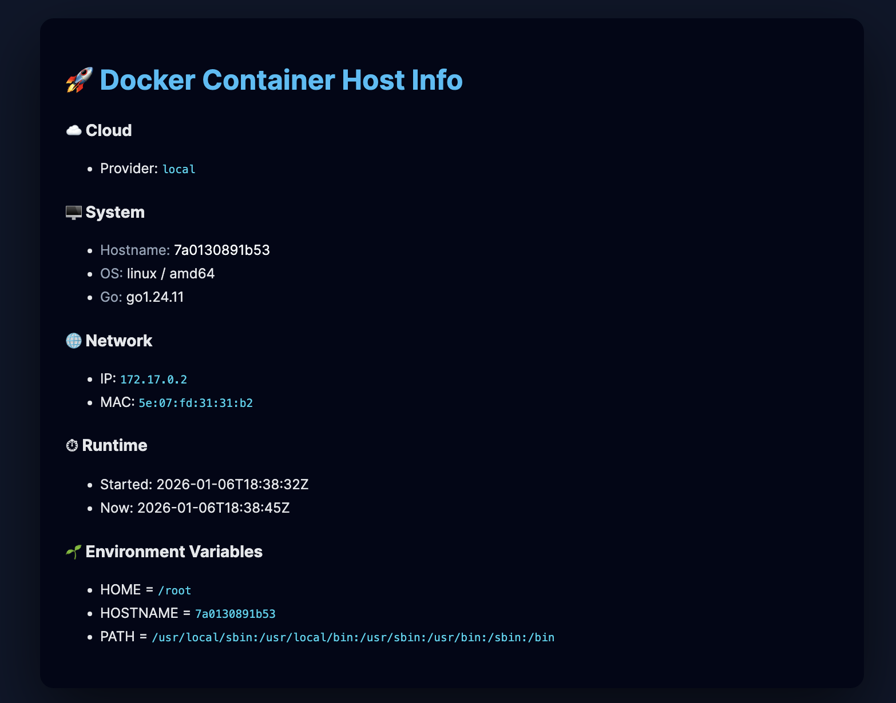

# Go Host Info Web App
[](https://golang.org)
[](LICENSE)

A lightweight **Golang web application** that displays detailed runtime information about the **host, container and cloud environment**.

Designed to run **as-is**:
- locally
- in Docker
- on AWS / GCP / Azure

✅ No special permissions  
✅ No cloud credentials  
✅ Safe for production  

## ✨ Features

### 🖥 Host & Container Info
- Hostname
- OS / Architecture
- Go version
- Container uptime
- Environment variables

### ☁️ Cloud Auto-Detection (no creds)
- AWS EC2 (instance ID, region, AZ, type)
- Google Cloud (project, zone, machine type)
- Azure (VM detection)
- Local / Docker fallback

### 🌐 Network
- IP addresses
- MAC addresses

### 🎨 UI
- Clean dark UI
- Structured sections
- Human-readable layout
- Browser-friendly dashboard

## 📸 Screenshot (example)


## 📦 Prerequisites
- **Go**: Version 1.21 or higher ([Download](https://golang.org/dl/))

## 🚀 Installation

### Clone the Repository

```bash
git clone https://github.com/MaksymLeus/hostinfo.git
cd hostinfo
```
### Install Dependencies

#### Backend
```bash
go mod download
```
## ⚡ Quick Start

### Build and Run

```bash
# Build the application
./build.sh

# Run the server
./hostinfo
```
Access the application at `http://localhost:8080`

## 🌐 Deployment

### Linux Server

```bash
# Build for Linux
./build.sh all

# Copy to server
scp bin/hostinfo-linux-x64 user@server:/opt/hostinfo/hostinfo

# Run on server
ssh user@server
cd /opt/hostinfo
./hostinfo
```
### systemd Service

Create `/etc/systemd/system/hostinfo.service`:

```ini
[Unit]
Description=Web Hostinfo Service
After=network.target

[Service]
Type=simple
User=www-data
WorkingDirectory=/opt/hostinfo
ExecStart=/opt/hostinfo/hostinfo
Restart=on-failure

[Install]
WantedBy=multi-user.target
```

Enable and start:

```bash
sudo systemctl enable hostinfo
sudo systemctl start hostinfo
sudo systemctl status hostinfo
```

## Preparation with Docker 🐳
Hostinfo is available as a Docker image for easy deployment.

**Image Details:**
- **Registry:** Docker Hub ([`maximleus/hostinfo`](https://hub.docker.com/r/maximleus/hostinfo))
- **Base Image:** `golang:1.24-alpine` 
- **Platforms:** `linux/amd64`, `linux/arm64`
- **Size:** ~100MB compressed


**Quick Start with Docker Compose:**
```bash
# Build the image
docker compose build
# Start with default settings
docker compose up -d
# Stop
docker compose down
# View logs
docker compose logs -f
```
**Or Quick Start directly:**
```bash
# Build the image
docker build -t hostinfo .
# Run container
docker run -p 8080:8080 hostinfo
```
Access the application at `http://localhost:8080`

## 💻 Development

### Backend Development

```bash
# Run with hot reload (use air or similar)
go run cmd/server/main.go

# Run tests
go test ./...

# Run tests with coverage
go test -cover ./...

# Format code
go fmt ./...

# Lint code
go vet ./...
```
### Development Workflow

1. Start backend:
   ```bash
   go run cmd/server/main.go
   ```
2. Open `http://localhost:3000` for hot-reload development

### Project Structure


```text
hostinfo
├── .dockerignore                 # Files/folders to ignore when building Docker images
├── .github
│   └── workflows
│       ├── ci.yml                # Main CI workflow: tests, lint, security
│       ├── template-docker.yml   # Reusable Docker build & push workflow
│       └── template-semantic-release.yml  # Reusable Semantic Release workflow
├── .gitignore                     # Git ignore rules
├── LICENSE.md                     # MIT license for the project
├── README.md                      # Project overview, usage, and instructions
├── TODO.md                         # TODO list for future development
├── build.sh                        # Optional build script for local or CI builds
├── cmd
│   └── server
│       └── hostinfo.go            # Main Go server entrypoint
├── docker
│   ├── Dockerfile                  # Dockerfile for building container
│   └── docker-compose.yml          # Docker Compose for multi-service setups
├── docs
│   └── semantic.md                 # Documentation for semantic release workflow
├── go.mod                          # Go module definition
├── internal
└── web
    ├── image.png                   # Example image used in web UI
    └── templates
        ├── index.html              # Main HTML template for the host info page
        └── index_to_update.html    # Optional template used for dynamic updates
```
#### Notes on structure:
- `.github/workflows`: All CI/CD workflows are here. Reusable templates (`template-docker.yml` and `template-semantic-release.yml`) make it easy to trigger builds or releases from other workflows.

- `cmd/server/hostinfo.go`: Go main entrypoint; you could add more commands in `cmd/` if needed.

- `web/templates`: HTML templates for rendering your host info page.

- `docker`: Contains Docker-related files. `docker-compose.yml` is optional but useful for multi-container setups.

- `docs/semantic.md`: Full guide on how semantic release works in this project.


## 🤝 Contributing

Contributions are welcome! Please follow these steps:

1. Fork the repository
2. Create a feature branch (`git checkout -b feature/amazing-feature`)
3. Commit your changes (`git commit -m 'feat: Add some amazing feature'`)
4. Push to the branch (`git push origin feature/amazing-feature`)
5. Open a Pull Request

### Development Guidelines

- Follow Go best practices and conventions
- Write tests for new features
- Update documentation as needed
- Ensure all tests pass before submitting PR
- Keep commits atomic and well-described

## 📝 License

This project is licensed under the MIT License - see the [LICENSE](LICENSE.md) file for details.